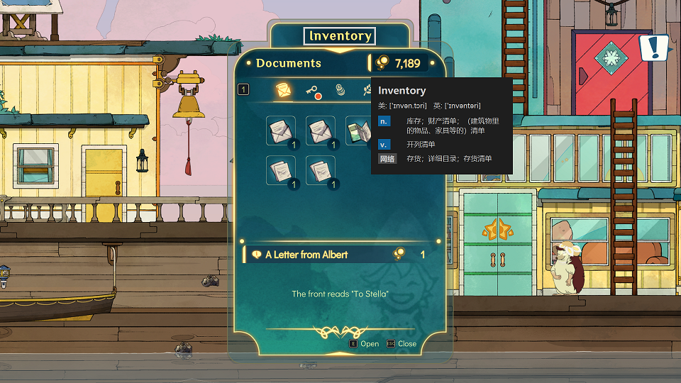

# playdict

（本项目仍在开发中，欢迎cv同学加入，查看[招募贴](recruit.md)）

playdict是一个为游戏场景设计的英语词典，具有沉浸式取词翻译的功能，它能够帮助玩家学习英语。

+   F1键：截屏取词
+   F2键：隐藏/显示窗口
+   F3键：退出程序

即使在全屏状态下，也不会打断您的游戏体验。

## 开发环境

+   Qt 5.15
+   C++ 11

## 联系作者

blueloveTH@qq.com